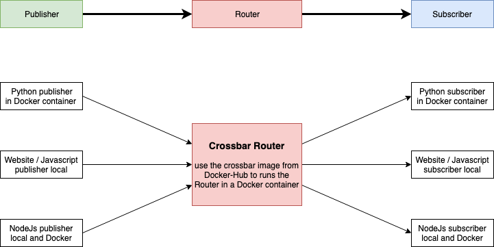
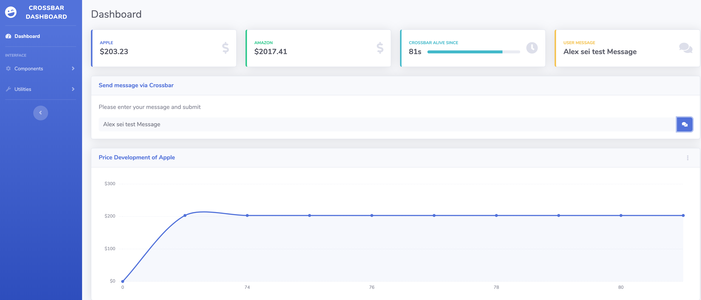

# Crossbar.io 

Little project documentation to learn crossbar. My aim was to get familiar with using crossbar WAMP router from Python, JavaScript and Nodejs as well as getting familiar with Docker.
Docker helps a lot to avoid the Python version conflicts which occure on the Mac often 

My plan was to create the following apps



### Docker

#### Crossbar Router
For the Router I used directly the Docker image availabel at http://docker-hub.com, following the tutorial from the https://crossbar.io website
The following comands starts a router

```
docker run -v  /Users/aortner/Playground/crossbario/:/node  --name=crossbar -it -p 8080:8080 crossbario/crossbario 
```
The image can be checked via
```
docker ps

CONTAINER ID   IMAGE.                 COMMAND                  CREATED         STATUS         PORTS                              NAMES
08b9f472507a   crossbario/crossbar    "crossbar start --cb…"   21 hours ago    Up 16 hours    8000/tcp, 0.0.0.0:8080->8080/tcp   crossbar

```

The correct functionality of the Router can be checked in the browser at http://localhost:8080/info


#### Crossbar Autobahn Client
The crossbario/autobahn-python image allows to create a docker environment with all libraries available to run client Python scripts ot publish and subscribe to the Router. I created a own image based on the official in order to install the additonal python libraries I would like to use. 
The **Dockerfile**

```
# My own dockerfile
# getting base image crossbario/autobahn-python
FROM crossbario/autobahn-python

MAINTAINER Alex Ortner <alex.ortner@record-evolution.de>

#RUN apt-get update
#RUN apt-get uprade

RUN pip install --upgrade pip

RUN pip install yahoo_fin

RUN pip install requests

RUN pip install pandas

CMD ["echo", "pyhon packaes installed"]
```

For the ** Publisher Script ** I start the  container with the following parameters

```
docker run -v /Users/aortner/Playground/crossbario/:/app -e CBURL="ws://crossbar:8080/ws" -e CBREALM="realm1" --name crossbar-pub --link=crossbar --rm -it mycrossbario:version1  python /app/python/my_python_publisher.py

```
This comand mounts my local volume `/Users/aortner/Playground/crossbario/` into the docker container which allows then to execute the Python Script `/Users/aortner/Playground/crossbario/python/my_python_publisher.py`. The flagg --links takes care that the client docker connects to the router docker correctly

For the ** Subscriber Script ** I start the  container with the following parameters

```
docker run -v /Users/aortner/Playground/crossbario/:/app --name crossbar_sub -e CBURL="ws://crossbar:8080/ws" -e CBREALM="realm1" --link=crossbar --rm -it mycrossbario:version1  python /app/python/my_python_subscriber.py

```
### Python
#### Publisher Script
The Script I created loads stock prices from Yahoo and publishes them into different topics. Beside of that an alive conter seds every second a number. This topics can then be subscribed from another Python or JavaScript app.

```
# Python Publisher Script

from autobahn.twisted.component import Component, run
from autobahn.twisted.util import sleep
from twisted.internet.defer import inlineCallbacks
import os
import argparse
import six
from yahoo_fin import stock_info as si


url = os.environ.get('CBURL', u'ws://localhost:8080/ws')
realmv = os.environ.get('CBREALM', u'realm1')
topic1a = os.environ.get('CBTOPIC', u'com.myapp.hello')
topic1b  = os.environ.get('CBTOPIC', u'com.myapp.alive')
topic2a = os.environ.get('CBTOPIC', u'com.myapp.apple')
topic3a = os.environ.get('CBTOPIC', u'com.myapp.amazon')
topic2b = os.environ.get('CBTOPIC', u'com.myapp.apple_price')
topic3b = os.environ.get('CBTOPIC', u'com.myapp.amazon_price')
topic4a = os.environ.get('CBTOPIC', u'com.myapp.host')
topic4b = os.environ.get('CBTOPIC', u'com.myapp.ip')

print(url, realmv)
component = Component(transports=url, realm=realmv)


@component.on_join
@inlineCallbacks
def joined(session, details):
    print("Publisher running")
    counter = 0
    while True:
        # publish() only returns a Deferred if we asked for an acknowledgement
        session.publish(topic1a, "Alive Counter: %d"%counter)
        session.publish(topic1b, str(counter))
        session.publish(topic2a, "Latest Stock Price from Apple: " + str(si.get_live_price("aapl")))
        session.publish(topic2b, str(round(si.get_live_price("aapl"),4)))
        session.publish(topic3a, "Latest Stock Price from Amazon: " + str(si.get_live_price("amzn")))
        session.publish(topic3b, str(round(si.get_live_price("amzn"),4)))
        #session.publish(topic4a, str(os.system("hostname")))
        #session.publish(topic4b, str(os.system("hostname -i")))
        counter += 1
        if counter>100:
        	counter=0
        	
        yield sleep(1)


if __name__ == "__main__":
    run([component])        
```

#### Subscriber Script

Simple Python script that subscribes to all topics and prints them on the concole

```
# Python Subscriber Script

from autobahn.twisted.component import Component, run
from autobahn.twisted.util import sleep
from twisted.internet.defer import inlineCallbacks
import os

url = os.environ.get('CBURL', u'ws://localhost:8080/ws')
realmvalue = os.environ.get('CBREALM', u'realm1')
topic1  = os.environ.get('CBTOPIC', u'com.myapp.hello')
topic2  = os.environ.get('CBTOPIC', u'com.myapp.apple')
topic3  = os.environ.get('CBTOPIC', u'com.myapp.amazon')
topic4  = os.environ.get('CBTOPIC', u'com.myapp.host')

component = Component(transports=url, realm=realmvalue)


@component.on_join
@inlineCallbacks
def joined(session, details):
    print("session ready")

    def oncounter(count):
        print("event received: ", count)

    try:
        yield session.subscribe(oncounter, topic1)
        print("subscribed to topic: " + topic1)
        yield session.subscribe(oncounter, topic2)
        print("subscribed to topic: " + topic2)
        yield session.subscribe(oncounter, topic3)
        print("subscribed to topic: " + topic3)
        yield session.subscribe(oncounter, topic4)
        print("subscribed to topic: " + topic4)
    except Exception as e:
        print("could not subscribe to topic: {0}".format(e))


if __name__ == "__main__":
    run([component])        
```

### JavaScript

#### Web Dashboard 
I put together a simple sb-admin-2 based dashboard visualize the subscribed data and to publish individual messagges.
The dashboard is filled via JavaScript. 
The functionality are

1. show values from topics (stock prices)
2. increase a status bar based on increasing alive counter
3. send individual messages from a input box triggert by a send button
4. accumulate and show a line chart of the price development



#### JavaScript Code
The Autobahn library has to be added into the index.html as well as the custom code
```
<script src="js/autobahn.min.js"></script>
<script src="js/frontend.js"></script>
```
The code that get and sends the data from the router and pushes them into the DOM is
```
try {
   var autobahn = require('autobahn');
} catch (e) {
   // when running in browser, AutobahnJS will
   // be included without a module system
}

var connection = new autobahn.Connection({
   url: 'ws://127.0.0.1:8080/ws',
   realm: 'realm1'}
);

var session1;
var myLabels =[0];
var myDatapoints=[0];

connection.onopen = function (session) {
 
   function price1(args) {
      console.log("Price 1:", args[0]);
      document.getElementById('box1').innerHTML = "$"+ args[0];
      myDatapoints.push(args[0]);
      //console.log(myDatapoints);
   }
   function price2(args) {
      console.log("Price 2:", args[0]);
      document.getElementById('box2').innerHTML = "$"+ args[0];
      myChartOptions.data.labels=myLabels;
      myChartOptions.data.datasets[0].data=myDatapoints;
      var myLineChart = new Chart(ctx,myChartOptions);
      console.log(myLabels);
      console.log(myDatapoints);
   }
   function alive(args) {
      console.log("Got Alive Message:", args[0]);
      document.getElementById('box3').innerHTML = args[0] + "s";
      document.getElementById('box4').style.width = args[0] +"%";
      myLabels.push(args[0]);
      //console.log(myLabels);
   }
   function usermessage(args) {
      console.log("Host Topic: " + args[0]);
      document.getElementById('box5').innerHTML = args[0];
   }

   session1=session;

   session.subscribe('com.myapp.apple_price', price1);
   session.subscribe('com.myapp.amazon_price', price2);
   session.subscribe('com.myapp.alive', alive);
   session.subscribe('com.myapp.host', usermessage);

   //

};


function sendMessage(session)
{  
   myMessage=document.getElementById("messageValue").value;
   session1.publish('com.myapp.host', [myMessage]);
   console.log("Published: " + myMessage);
   document.getElementById('box5').innerHTML = myMessage;
}

connection.open();
```

### Nodejs

Create a new folder an initialze it with npm, then install the autobahn lib and create an index.js file 
```
npm init
npm install autobahn
touch index.js 
```

with containing the below code 

```
var autobahn = require('autobahn');
var http = require('http');

console.log("Running AutobahnJS " + autobahn.version);

const url = 'ws://127.0.0.1:8080/ws';
const realm = 'realm1';


var connection = new autobahn.Connection({url: url, realm: realm});

connection.onopen = function (session, details) {
   //console.log("session open!", details);
   console.log("session open!");

   
   // subscribe to the topics
   function onevent(args) {
      console.log("Event:", args[0]);
   }
   session.subscribe('com.myapp.apple', onevent);
   session.subscribe('com.myapp.amazon', onevent);
   session.subscribe('com.myapp.host', onevent);
   session.subscribe('com.myapp.alive', onevent);

   // publish a test message
   session.publish('com.myapp.host', ['Message from Nodejs  ']);

   //connection.close();
};

connection.onclose = function (reason, details) {
   console.log("session closed: " + reason, details);
}

connection.open();
```


