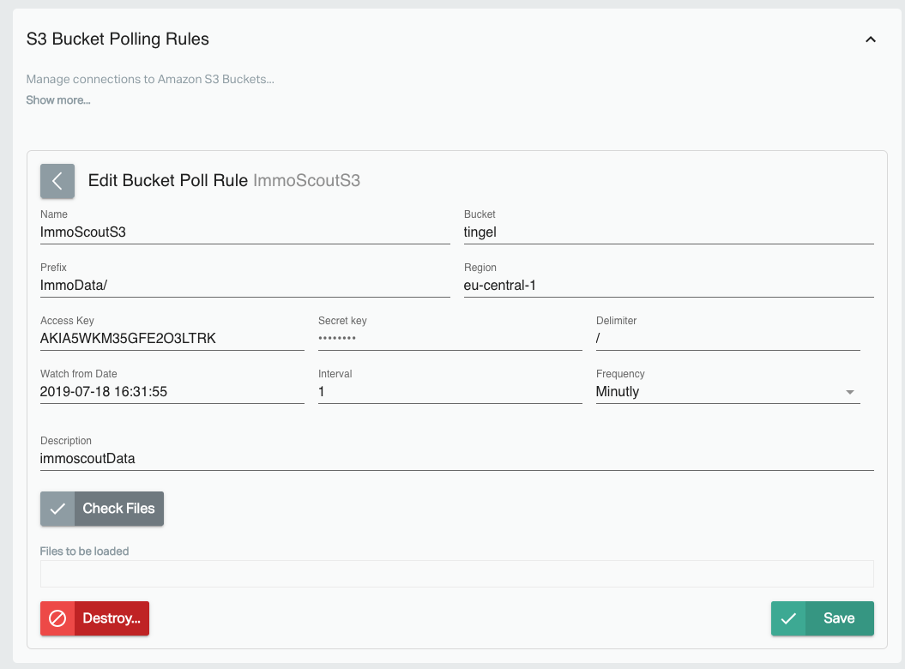

# Repods Project 2: ImmoScout Data Analysis


In order to load massive amount of data, sort out duplicates, archive autdated data and run some data science on the data 
I want to scrap from ImmoScout Website and store it into RePods.


### Business goal - why?
1. visualize the time series of the sensor data in a line chart
2. get some meta informations to answer the following questions
	* do the data come regular or not over time
	* is the system robust over a longer time

### Technical goal - what?
| No | Link |To Do | status |
|----|:--------------------|-------|:----:|
| 1. |[Website Scraper](#1._Website_Scraper) | Crawl the search result data from the Immoscout24 website | ✔ |
| 2. |[Data Stream - Crossbar](#2._Data_Stream_-_Crossbar) | Send the data via crossbar messaging to Repods  | ✔ |
| 3. |[Data Stream - S3 Bucket](#3._Data_Stream_-_S3_Bucket) | Send the data via S3 Bucket to Repods  | ✗ |
| 4. |[Data Stream - FTP](#4._Data_Stream_-_FTP) | Send the data via FTP server to Repods  | ✗ |
| 5. |[Data Transformation - Pipe](#5._Data_Transformation_-_Pipe) | Implement file watch dog and sql to extract | ✔ |
| 6. |[Data Master - Target](#6._Data_Master_-_Target) | Generate a master tabel with a proper history of the data  | ✔ |
| 7. |[Repods - Workbook](#7._Repods_-_Workbook) | Generate a repods workbook to get time series data prepared for Infograph and REST API | ✗| 
| 8. |[Jupyter - Data Frame](#8._Jupyter_-_Data_Frame) | load the data into a Pandas dataframe for further analysis  | ✔ |
| 9. |[Jupyter - Visualize data](#9._Jupyter_-_Visualize_data) | Plot data usefull over a map and do other statistics   | ✔ |
| 10. |[Rest API - Postman](#10._Rest_API_-_Postman) | connect to Rest API via Postman and test all requests | ✔ |
| 11. |[Rest API - NodeJs](#11._Rest_API_-_NodeJs) | connect to Rest API via Nodejs and output to `console.log` | ✔ | 
| 12. |[Rest API - Website](#12._Rest_API_-_Website) | connect to Rest API via JavaScript and show on Web dashboard | ✗ | 


## 1. Website Scraper

There are already some special scripts for ImmoScout data scraping available izt there for out there which are based on the main scraper libraries [BeautifulSoup](https://www.crummy.com/software/BeautifulSoup/ ) and [Scrapy](https://scrapy.org/)

| Name | Link | Library | Info
|----|:--------------------| -- |
| StatisQuo Data Science Blog | https://statisquo.de/wp-content/uploads/2017/11/ImmobilienScout24-Mining.html | BeautifulSoup | Simple |
| ImmoSpider| https://github.com/asmaier/ImmoSpider | Scrapy |  ML example for Jupyter |
| ImmoScraper | https://github.com/balzer82/immoscraper | BeautifulSoup | Data Analysis example for Jupyter |


I built a fast PoC in Jupyter to load the search results in a data frame. Fortunately all the relevant data are available on each expose detail website as a JSON object `keyValues` that is directly parsed. The script is realized with BeautifulSoup and based on the tutorial at the StatisQuo Data Science Blog: https://statisquo.de/wp-content/uploads/2017/11/ImmobilienScout24-Mining.html


[Go to Immoscout24 search results](https://www.immobilienscout24.de/Suche/S-T/Haus-Kauf/Polygonsuche/wqtoHexyn@saKabDspE%7D~IasLsf%5D_%7DBhEsqLgzGgaGflAwcDa%7B@qnJldEk_LdvTnDrGirI%7BbH%3Fk%7C%5EnyKsqGjaHu_NpbIw_C~~D%7DwBpp@_iKcm@mZu~@aWuxCePlZor@qbIvmIcrBePmmCabDwhDsfQ%7DI%7DsS%7DqBczRbfAaiGnjHktIgScRu%60Am%7DAz_@q%7CHpuFs_NxnLix@kH%7DyBmp@%7BtA%7Bu@swg@jfA%7BpC%60bH_mEzfGjrKv%7CD%7Cnc@xb@wPrmMj%7DAxhHx%7BDx%7BExs%5EocCxpN_jI%7BpCyzOufQ_cCfzGofAl%60Ro%7DBldEZn%60B%7B%60@hvC~_@rcLnZ~zKhkDrmAfnE%60q@f%7BE%3Fho@xiGwt@tcE%60v@bpJwcCnmHsbCt%60HjgGnuPmGxw@tkCvu@hvTybHjlA%7D~IzoDu_Ct~Gzi@jaAtjDiv@bdf@jqEd%7DWmaAv_C/6,00-/100,00-/EURO--700000,00/-/-/-/14,15,21,24,119,122,126?enteredFrom=result_list)


### Jupyter Notebook 
File: `ImmoScraper_ToFile.ipynb`

```python
# Load the libraries
import bs4 as bs
import urllib.request
import time
from datetime import datetime
import pandas as pd
import json
import lxml


# define the main function
def ImmoScraper(url_before,url_after):
    
    # default url to start
    url_pagination="P-1"
    url=url_before+url_pagination+url_after
    #print("url: " + url)
    df = pd.DataFrame()
    l=[]
    pub_counter=1
    
    print(str(datetime.now())+": ImmoScraper started...") 
    try:
        
        #get the html 
        soup = bs.BeautifulSoup(urllib.request.urlopen(url).read(),'lxml')
        
        # get the index and tge maximum of the pages to scan     
        select_options = soup.select('select[aria-label=Seitenauswahl] > option')
        
        print("Pages to Scan: " + select_options[-1].getText())
        
        total_counter = 1
        
        for page in select_options:
            page_number=page.getText()
            l=[]
            
            if int(page_number) >2:
                print("Aborted after Page: " + str(int(page_number)-1))
                break
                
            print("Scanning Page " + page.getText())
            
            url=url_before+"P-"+page_number+url_after
            
            #get the html 
            soup = bs.BeautifulSoup(urllib.request.urlopen(url).read(),'lxml')
            
            # loop throug search result and save every link to the detail page to a list
            for paragraph in soup.find_all("a"):

                if r"/expose/" in str(paragraph.get("href")):
                    l.append(paragraph.get("href").split("#")[0])

                l = list(set(l))

            # call every detail page and extract the JSON with the keyValues of the expose
            item_counter=1
            
            for item in l:

                try:

                    soup = bs.BeautifulSoup(urllib.request.urlopen('https://www.immobilienscout24.de'+item).read(),'lxml')

                    data = pd.DataFrame(json.loads(str(soup.find_all("script")).split("keyValues = ")[1].split("}")[0]+str("}")),index=[str(datetime.now())])
                    data["url"] = str(item)
                    beschreibung = []

                    for i in soup.find_all("pre"):
                        beschreibung.append(i.text)

                    data["beschreibung"] = str(beschreibung)
                    
                    #print(str(item_counter) + ". " + str(datetime.now()) + " JSON published: ID=" + data.obj_scoutId[0] + "  Page=" + str(page_number) + "  Item=" + str(item_counter) + "  Total=" + str(total_counter))
                
                    df = df.append(data,sort=True)
                    item_counter+=1
                    total_counter += 1

                except Exception as e: 
                    print(str(datetime.now())+": " + str(e))
                    l = list(filter(lambda x: x != item, l))
                    print("ID " + str(item) + " entfernt.")

       # df.to_csv("ImmoData/"+str(datetime.now())[:19].replace(":","").replace(".","")+".csv",sep=";",decimal=",",encoding = "utf-8",index_label="timestamp")     
        #print(str(datetime.now())+": Data set successfully crawled and stored to csv file >> " + "ImmoData/"+str(datetime.now())[:19].replace(":","").replace(".","")+".csv" )
        print(str(datetime.now())+": ImmoScraper done." )
        
        return df

        
    except Exception as e: 
        print(str(datetime.now())+": Something went wrong with Crawling -> " + str(e))
        


# set the url parameters
url_before="https://www.immobilienscout24.de/Suche/S-T/"
url_pagination="P-1"
url_after="/Haus-Kauf/Polygonsuche/wqtoHexyn@saKabDspE%7D~IasLsf%5D_%7DBhEsqLgzGgaGflAwcDa%7B@qnJldEk_LdvTnDrGirI%7BbH%3Fk%7C%5EnyKsqGjaHu_NpbIw_C~~D%7DwBpp@_iKcm@mZu~@aWuxCePlZor@qbIvmIcrBePmmCabDwhDsfQ%7DI%7DsS%7DqBczRbfAaiGnjHktIgScRu%60Am%7DAz_@q%7CHpuFs_NxnLix@kH%7DyBmp@%7BtA%7Bu@swg@jfA%7BpC%60bH_mEzfGjrKv%7CD%7Cnc@xb@wPrmMj%7DAxhHx%7BDx%7BExs%5EocCxpN_jI%7BpCyzOufQ_cCfzGofAl%60Ro%7DBldEZn%60B%7B%60@hvC~_@rcLnZ~zKhkDrmAfnE%60q@f%7BE%3Fho@xiGwt@tcE%60v@bpJwcCnmHsbCt%60HjgGnuPmGxw@tkCvu@hvTybHjlA%7D~IzoDu_Ct~Gzi@jaAtjDiv@bdf@jqEd%7DWmaAv_C/6,00-/100,00-/EURO--700000,00/-/-/-/14,15,21,24,119,122,126"

# run the function and check the output
ImmoData=ImmoScraper(url_before,url_after)
ImmoData.head()
```
Output:
    2019-07-18 12:07:44.275994: ImmoScraper started...
    Pages to Scan: 20
    Scanning Page 1
    Scanning Page 2
    Aborted at page: 2
    2019-07-18 12:07:59.753971: ImmoScraper done.


to be either stored for history tracking and analized with Data Sciene later


## 2. Data Stream - Crossbar

Wrote a python script that combines the publisher script for Crossbar and the above ImmoScraper to one and publishes every result set as a JSON to the router


Start via Docker 
```bash
docker run -v /Users/aortner/Playground/ImmoScraper/:/app -e CBURL="ws://104.199.76.81:8081/ws" -e CBREALM="realm1" --name crossbar-pub --link=crossbar --rm -it autobahn_python_client:version1  python /app/ScraperPublisher.py
```

The Docker execute the script `ScraperPublisher.py`. unfortunately there is an issue with the `yield sleep(1)` usage that I did not understand and that does not allow me to import the scraper as an external function. It only works correctly when everything is in the main function


```python
from autobahn.twisted.component import Component, run
from autobahn.twisted.util import sleep
from twisted.internet.defer import inlineCallbacks
import os
import argparse
import six
import time
from datetime import datetime
import random
import bs4 as bs
import urllib.request
from datetime import datetime
import pandas as pd
import json
import lxml

# URL for Immoscout24 search
url_before = "https://www.immobilienscout24.de/Suche/S-T/"
url_pagination = "P-1"
url_after = "/Haus-Kauf/Polygonsuche/wqtoHexyn@saKabDspE%7D~IasLsf%5D_%7DBhEsqLgzGgaGflAwcDa%7B@qnJldEk_LdvTnDrGirI%7BbH%3Fk%7C%5EnyKsqGjaHu_NpbIw_C~~D%7DwBpp@_iKcm@mZu~@aWuxCePlZor@qbIvmIcrBePmmCabDwhDsfQ%7DI%7DsS%7DqBczRbfAaiGnjHktIgScRu%60Am%7DAz_@q%7CHpuFs_NxnLix@kH%7DyBmp@%7BtA%7Bu@swg@jfA%7BpC%60bH_mEzfGjrKv%7CD%7Cnc@xb@wPrmMj%7DAxhHx%7BDx%7BExs%5EocCxpN_jI%7BpCyzOufQ_cCfzGofAl%60Ro%7DBldEZn%60B%7B%60@hvC~_@rcLnZ~zKhkDrmAfnE%60q@f%7BE%3Fho@xiGwt@tcE%60v@bpJwcCnmHsbCt%60HjgGnuPmGxw@tkCvu@hvTybHjlA%7D~IzoDu_Ct~Gzi@jaAtjDiv@bdf@jqEd%7DWmaAv_C/6,00-/100,00-/EURO--700000,00/-/-/-/14,15,21,24,119,122,126"


# URL of crossbar router
url = os.environ.get('CBURL', u'ws://104.199.76.81:8081/ws')

realmv = os.environ.get('CBREALM', u'realm1')
topic_alive = os.environ.get('CBTOPIC', u'com.immoscraper.alive')
topic_json = os.environ.get('CBTOPIC', u'com.immoscraper.json')


print("#####################################################")
print("Immoscout24 Scraper running and publishing to Repods")
print("#####################################################")

print(str(datetime.now()) + " URL connecting: " + url)
print(str(datetime.now()) + " Realm used: " + realmv)

component = Component(transports=url, realm=realmv)


@component.on_join
@inlineCallbacks
def joined(session, details):
    print("Publisher running")
    counter = 0

    session.publish(topic_alive, str(counter))


    # default url to start
    url_pagination = "P-1"
    url = url_before+url_pagination+url_after

    l = []

    print(str(datetime.now())+": ImmoScraper started...")
    try:

        # get the html
        soup = bs.BeautifulSoup(urllib.request.urlopen(url).read(), 'lxml')

        # get the index and tge maximum of the pages to scan
        select_options = soup.select('select[aria-label=Seitenauswahl] > option')
        
        print("Pages to Scan: " + select_options[-1].getText())
        total_counter = 1

        for page in select_options:
            page_number = page.getText()
            l = []

            print("Scanning Page " + page.getText())

            url = url_before+"P-"+page_number+url_after

            # get the html
            soup = bs.BeautifulSoup(urllib.request.urlopen(url).read(), 'lxml')

            # loop throug search result and save every link to the detail page to a list
            for paragraph in soup.find_all("a"):

                if r"/expose/" in str(paragraph.get("href")):
                    l.append(paragraph.get("href").split("#")[0])

                l = list(set(l))

            # call every detail page and extract the JSON with the keyValues of the expose
            item_counter = 1

            for item in l:

                try:

                    soup = bs.BeautifulSoup(urllib.request.urlopen('https://www.immobilienscout24.de'+item).read(), 'lxml')

                    data = pd.DataFrame(json.loads(str(soup.find_all("script")).split("keyValues = ")[1].split("}")[0]+str("}")), index=[str(datetime.now())])

                    data["url"] = str(item)

                    beschreibung = []

                    for i in soup.find_all("pre"):
                        beschreibung.append(i.text)

                    data["beschreibung"] = str(beschreibung)

                    session.publish(topic_json, data.to_dict(orient='records')[0])
                    
                    #session.publish(topic_json, "TEST:  Page=" + str(page_number) + "  Item=" + str(item_counter) + "  Total=" + str(total_counter))

                    print(str(item_counter) + ". " + str(datetime.now()) + " JSON published: ID=" + data.obj_scoutId[0] + "  Page=" + str(
                        page_number) + "  Item=" + str(item_counter) + "  Total=" + str(total_counter))
                    
                    #df = df.append(data)

                    item_counter += 1
                    total_counter += 1

                    yield sleep(0.1)

                    # break

                except Exception as e:
                    print("ERROR: " + str(e))
                    l = list(filter(lambda x: x != item, l))
                    print("ID " + str(item) + " entfernt.")
                    break

        #df.to_csv("ImmoData/"+str(datetime.now())[:19].replace(":","").replace(".","")+".csv",sep=";",decimal=",",encoding = "utf-8",index_label="timestamp")
        #print(str(datetime.now())+": Data set successfully saved to csv file >> " + "ImmoData/"+str(datetime.now())[:19].replace(":","").replace(".","")+".csv" )
        print(str(datetime.now()) + ": ImmoScraper done.")

    except Exception as e:
        print(str(datetime.now()) +
              ": Something went wrong with Crawling -> " + str(e))


if __name__ == "__main__":
    run([component])


```

The data are then collected in Repods over the topic `com.immoscraper.json`. Also I now unsing the Record-Evolution company router `cb.reswarm.io` at `ws://104.199.76.81:8081/ws`
The JSON object is then transformed in the pipe and inserted to a event table. Here I need to add the columns `VALID_FROM` and `VALID_TO`

```sql
SELECT 
(payload_args[1]->>'obj_scoutId')::int as obj_scoutId                               
,received_at as VALID_FROM  
,'infinity'::timestamptz as VALID_TO 
,payload_args[1]->'obj_regio1' as obj_regio1
,payload_args[1]->'obj_heatingType' as obj_heatingType
,payload_args[1]->'obj_telekomTvOffer' as obj_telekomTvOffer
,payload_args[1]->'ga_cd_customer_group' as ga_cd_customer_group
,payload_args[1]->'obj_telekomHybridUploadSpeed' as obj_telekomHybridUploadSpeed
,payload_args[1]->'obj_cId' as obj_cId
,payload_args[1]->'obj_newlyConst' as obj_newlyConst
,payload_args[1]->'obj_plotAreaRange' as obj_plotAreaRange
,payload_args[1]->'obj_picture' as obj_picture
,payload_args[1]->'obj_picturecount' as obj_picturecount
,payload_args[1]->'obj_pricetrend' as obj_pricetrend
,payload_args[1]->'obj_telekomUploadSpeed' as obj_telekomUploadSpeed
,payload_args[1]->'obj_lotArea' as obj_lotArea
,payload_args[1]->'obj_telekomTrackingGroup' as obj_telekomTrackingGroup
,payload_args[1]->'obj_telekomInternetTechnology' as obj_telekomInternetTechnology
,payload_args[1]->'obj_yearConstructed' as obj_yearConstructed
,payload_args[1]->'obj_telekomInternetType' as obj_telekomInternetType
,payload_args[1]->'obj_galleryAd' as obj_galleryAd
,payload_args[1]->'ga_cd_test_cxp_ads' as ga_cd_test_cxp_ads
,payload_args[1]->'obj_pricetrendbuy' as obj_pricetrendbuy
,payload_args[1]->'obj_firingTypes' as obj_firingTypes
,payload_args[1]->'obj_ExclusiveExpose' as obj_ExclusiveExpose
,payload_args[1]->'obj_telekomInternetProductName' as obj_telekomInternetProductName
,payload_args[1]->'obj_courtage' as obj_courtage
,payload_args[1]->'geo_bln' as geo_bln
,payload_args[1]->'obj_cellar' as obj_cellar
,payload_args[1]->'obj_purchasePriceRange' as obj_purchasePriceRange
,payload_args[1]->'obj_yearConstructedRange' as obj_yearConstructedRange
,payload_args[1]->'obj_houseNumber' as obj_houseNumber
,payload_args[1]->'obj_pricetrendrent' as obj_pricetrendrent
,payload_args[1]->'obj_livingSpace' as obj_livingSpace
,payload_args[1]->'geo_krs' as geo_krs
,payload_args[1]->'obj_zipCode' as obj_zipCode
,payload_args[1]->'obj_condition' as obj_condition
,payload_args[1]->'ga_cd_test_cxp_expose_widgets' as ga_cd_test_cxp_expose_widgets
,payload_args[1]->'obj_interiorQual' as obj_interiorQual
,payload_args[1]->'ga_cd_cxp_historicallisting' as ga_cd_cxp_historicallisting
,payload_args[1]->'obj_telekomDownloadSpeed' as obj_telekomDownloadSpeed
,payload_args[1]->'obj_street' as obj_street
,payload_args[1]->'obj_telekomInternetUrlMobile' as obj_telekomInternetUrlMobile
,payload_args[1]->'obj_telekomInternetUrl' as obj_telekomInternetUrl
,payload_args[1]->'obj_streetPlain' as obj_streetPlain
,payload_args[1]->'geo_plz' as geo_plz
,payload_args[1]->'obj_noRooms' as obj_noRooms
,payload_args[1]->'obj_constructionPhase' as obj_constructionPhase
,payload_args[1]->'obj_ityp' as obj_ityp
,payload_args[1]->'obj_telekomHdTelephone' as obj_telekomHdTelephone
,payload_args[1]->'geo_land' as geo_land
,payload_args[1]->'ga_cd_via' as ga_cd_via
,payload_args[1]->'obj_telekomInternet' as obj_telekomInternet
,payload_args[1]->'obj_immotype' as obj_immotype
,payload_args[1]->'obj_telekomHybridDownloadSpeed' as obj_telekomHybridDownloadSpeed
,payload_args[1]->'obj_rented' as obj_rented
,payload_args[1]->'obj_telekomInternetServices' as obj_telekomInternetServices
,payload_args[1]->'obj_telekomInternetProductAvailable' as obj_telekomInternetProductAvailable
,payload_args[1]->'obj_cwId' as obj_cwId
,payload_args[1]->'ga_cd_test_cxp_expose' as ga_cd_test_cxp_expose
,payload_args[1]->'obj_purchasePrice' as obj_purchasePrice
,payload_args[1]->'ga_cd_application_requirements' as ga_cd_application_requirements
,payload_args[1]->'obj_numberOfFloors' as obj_numberOfFloors
,payload_args[1]->'obj_buildingType' as obj_buildingType
,payload_args[1]->'obj_noRoomsRange' as obj_noRoomsRange
,payload_args[1]->'ga_cd_maillead_default_shown' as ga_cd_maillead_default_shown
,payload_args[1]->'obj_barrierFree' as obj_barrierFree
,payload_args[1]->'obj_international' as obj_international
,payload_args[1]->'obj_regio3' as obj_regio3
,payload_args[1]->'obj_objectnumber' as obj_objectnumber
,payload_args[1]->'obj_livingSpaceRange' as obj_livingSpaceRange
,payload_args[1]->'obj_regio2' as obj_regio2
,payload_args[1]->'url' as url
,payload_args[1]->'beschreibung' as beschreibung
FROM SC32519_S_IOTDATA r1
WHERE SPLIT_PART(payload_kwargs->'details'->>'topic','.',3) like '%json%'
--AND package_id in (52484,52475)
ORDER BY package_id desc
```

## 3. Data Stream - S3 Bucket

### a) Create AWS S3 Bucket
From the AWS management concole I searched for S3 and created a new S3 Bucket.
For external access I had to create a user `tingel` and a group which I gave the permission from the `AmazonS3FullAccess` policy
The tricky part was to find the correct Region string. It is not the value shown in AWS EU (Frankfurt) but the one shown in the url of the bucket manager `eu-central-1`

### b) Push data with Python to AWS

Amazon offers a Python library `boto3` which is well documented with examples at https://docs.aws.amazon.com/code-samples/latest/catalog/python-s3-s3.py.html 
The file is uploaded via

```python
# import amazon lib
import boto3

# create connection to aws
MyKey='AKIA5WKMxxxMYKEYxxxEd2O3LTRK'
MySecret='HeOtTdFkNdV5YOxxxMYFKEYxxxayOUMyIc637pg8v9nW8ttm'

s3 = boto3.client('s3', aws_access_key_id=MyKey,aws_secret_access_key=MySecret,region_name='eu-central-1')

# upload file to a bucket
filenaame = 'path/filename.csv'
bucket = 'tingel'
s3.upload_file(filename,bucket, filename)

# show buckets in account
bucketlist = s3.list_buckets()
for obj in bucketlist['Buckets']:
            print(obj["Name"])

# show files in bucket
filelist = s3.list_objects_v2(Bucket=bucket)
for obj in filelist['Contents']:
            print(obj["Key"])

```


### c) create S3 connector in Repods

The most complicated part here was to find out the region code. It is same then for the Pyton script `eu-central-1`



## 4. Data Stream - FTP 
did not work yet

## 5. Data Transformation - Pipe

Had to add the correct flavor of the regular expression to detect the files that are delivered. 

The regular expression Syntax for JavaScript is
`FileCore_(.*).csv`
and can be tested at https://regex101.com/

The transformation SQL in the pipe is

```sql
SELECT 
"obj_scoutId"
,"load_date" as EVENT_DATE
,"beschreibung"
,"ga_cd_application_requirements"
,"ga_cd_customer_group"
,"ga_cd_cxp_historicallisting"
,"ga_cd_developer_virtualreality"
,"ga_cd_maillead_default_shown"
,"ga_cd_test_cxp_ads"
,"ga_cd_test_cxp_expose_widgets"        
,"ga_cd_via"
,"ga_cd_via_qualified"
,"geo_bln"
,"geo_krs"
,"geo_land"
,"geo_plz"
,"obj_ExclusiveExpose"
,"obj_barrierFree"
,"obj_buildingType"
,"obj_cId"
,"obj_cellar"
,"obj_condition"
,"obj_constructionPhase"
,"obj_courtage"
,"obj_cwId"
,"obj_energyEfficiencyClass"
,"obj_energyType"
,"obj_firingTypes"
,"obj_galleryAd"
,"obj_groupnumber"
,"obj_heatingType"
,"obj_houseNumber"
,"obj_immotype"
,"obj_interiorQual"
,"obj_international"
,"obj_ityp"
,"obj_lastRefurbish"
,"obj_livingSpace"
,"obj_livingSpaceRange"
,"obj_lotArea"
,"obj_newlyConst"
,"obj_noParkSpaces"
,"obj_noRooms"
,"obj_noRoomsRange"
,"obj_numberOfFloors"
,"obj_objectnumber"
,"obj_picture"
,"obj_picturecount"
,"obj_plotAreaRange"
,"obj_pricetrend"
,"obj_pricetrendbuy"
,"obj_pricetrendrent"
,"obj_project_id"
,"obj_purchasePrice"
,"obj_purchasePriceRange"
,"obj_regio1"
,"obj_regio2"
,"obj_regio3"
,"obj_rented"
,"obj_street"
,"obj_streetPlain"
,"obj_telekomDownloadSpeed"
,"obj_telekomHdTelephone"
,"obj_telekomHybridDownloadSpeed"
,"obj_telekomHybridUploadSpeed"
,"obj_telekomInternet"
,"obj_telekomInternetProductA_67"
,"obj_telekomInternetProductName"
,"obj_telekomInternetServices"
,"obj_telekomInternetTechnology"
,"obj_telekomInternetType"
,"obj_telekomInternetUrl"
,"obj_telekomInternetUrlMobile"
,"obj_telekomTrackingGroup"
,"obj_telekomTvOffer"
,"obj_telekomUploadSpeed"
,"obj_thermalChar"
,"obj_usableArea"
,"obj_yearConstructed"
,"obj_yearConstructedRange"
,"obj_zipCode"
,"url"
,"_filename_"

FROM S_IMMOSCOUTS3

```

## 8. Jupyter - Data Frame
Connect from a Jupyter notebook via Python to the Postgres database and load data directly into a dataframe

```python
import psycopg2 as pgsgl
import pandas as pd


hostname = 'jumper1.repods.io'
username = 'tingel'
password = 'tingel'
database = 'reone'
port = '49161'

try:
    conn = pgsgl.connect( host=hostname, user=username, password=password, dbname=database, port=port )
    print("Yes!! connect to the database")
except:
    print("ERROR: I am unable to connect to the database")
    
try: 
    sqlquery='Select * from schema_abm.t_immoscout_2'
    df = pd.read_sql(sqlquery,con=conn)
    print("Hurra!! Data loaded into Dataframe")
except:
    print("ERROR: Data load failed")
    
conn.close()
```


## 9. Jupyter - Visualize data

### Show Number and Price on Map
1. count how much houses are sold in each plz area and plot on map
2. show average price per plz on map

```python
#prepare data from Repods
geo_statistics=df.groupby(['geo_plz']).agg(['count','mean','min','max'])[['obj_purchasePrice']]['obj_purchasePrice'].reset_index()
geo_statistics['geo_plz']=geo_statistics['geo_plz'].apply(int).apply(str)
geo_statistics['mean']=geo_statistics['mean'].round().apply(int)
geo_statistics['min']=geo_statistics['min'].round().apply(int)
geo_statistics['max']=geo_statistics['max'].round().apply(int)
geo_statistics.head()


# load Shapes of each plz as geoshape.json
# Data set downloaded from http://opendatalab.de/projects/geojson-utilities/
# Data cleansing by removing all entries that have no plz/zip

# load json file to python objects
with open('GeoData/ImmoScoutGeoData200km2.geojson') as f:
    geo_json_kreise = json.load(f)

# clean up the json and delete all not needed attributes
del geo_json_kreise['crs']
del geo_json_kreise['source']


elementCounter=0
for singleFeature in geo_json_kreise['features']: 
    if 'destatis' in singleFeature['properties']:
        singleFeature['plz']=singleFeature['properties']['destatis']['zip']

    else:
        if singleFeature['properties']['BEZ']=='Gemeindefreies Gebiet':
            print('No plz - set value to 10000 ' + str(elementCounter))
            singleFeature['plz']='10000'
            
        else:
            print('Issue ' + str(elementCounter))
            singleFeature['plz']='20000'
            
    del singleFeature['properties']
    elementCounter+=1
    
    
# Delete Polygons that do have no zip code to identify
elementCounter=0
for singleFeature in geo_json_kreise['features']: 
    if singleFeature['plz'] =='10000': 
        print ("Number=" + str(elementCounter) + "with plz =" + singleFeature['plz'] + " deleted")
        del geo_json_kreise['features'][elementCounter]
    
    elementCounter+=1

# creagte map with folium

m2 = folium.Map(location=[50.2, 8.5],tiles='cartodbpositron', zoom_start=9)

folium.Choropleth(
    geo_data=geo_json_kreise,
    name='Count',
    data=geo_statistics,
    columns=['geo_plz', 'count'],
    key_on='feature.plz',
    fill_color='YlGn',
    fill_opacity=0.7,
    line_opacity=0.2,
    legend_name='Number of Houses'
).add_to(m2)

folium.Choropleth(
    geo_data=geo_json_kreise,
    name='Mean Price',
    data=geo_statistics,
    columns=['geo_plz', 'mean'],
    key_on='feature.plz',
    fill_color='BuPu',
    fill_opacity=0.7,
    line_opacity=0.2,
    legend_name='Average Price'
).add_to(m2)


folium.LayerControl().add_to(m2)


#m2.save('maptest.html')
m2
```

Schmitten has most of 


Rodgau is quite expensive


### Data investigation by grouping


```python
kreis_analysis=df.groupby(['geo_bln','geo_krs']).agg(['count','mean','min','max'])[['obj_purchasePrice']]['obj_purchasePrice'].reset_index()
kreis_analysis.columns=['land','kreis','anzahl','mean price','min price','max price']
kreis_analysis['mean price']=kreis_analysis['mean price'].round().apply(int)
kreis_analysis['max price']=kreis_analysis['max price'].round().apply(int)
kreis_analysis['min price']=kreis_analysis['min price'].round().apply(int)
```

#### Landkreis sorted by mean price


```python
kreis_analysis.sort_values('mean price',ascending=False)
```
|  | land | kreis | anzahl | mean price | min price | max price |
| --- | --- | --- | --- | --- | --- | --- |
| 10 | Rheinland_Pfalz | Alzey_Worms_Kreis | 24 | 563462 | 445000 | 645000 |
| 5 | Hessen | Offenbach_Kreis | 51 | 556471 | 346000 | 699000 |
| 6 | Hessen | Offenbach_am_Main | 6 | 553667 | 396000 | 685000 |
| 9 | Hessen | Wiesbaden | 20 | 547000 | 340000 | 679000 |
| 4 | Hessen | Main_Taunus_Kreis | 33 | 545661 | 260000 | 699000 |
| 0 | Hessen | Frankfurt_am_Main | 3 | 539667 | 460000 | 699000 |
| 1 | Hessen | Hochtaunuskreis | 83 | 502304 | 169000 | 699000 |
| 3 | Hessen | Main_Kinzig_Kreis | 237 | 482370 | 159000 | 700000 |
| 8 | Hessen | Wetteraukreis | 60 | 478832 | 280000 | 679000 |
| 11 | Rheinland_Pfalz | Bad_Kreuznach_Kreis | 38 | 471916 | 319000 | 700000 |
| 12 | Rheinland_Pfalz | Mainz_Bingen_Kreis | 72 | 469969 | 149000 | 700000 |
| 7 | Hessen | Rheingau_Taunus_Kreis | 81 | 465735 | 0 | 695000 |
| 2 | Hessen | Limburg_Weilburg_Kreis | 101 | 398275 | 100000 | 686000 |
| 13 | Rheinland_Pfalz | Rhein_Lahn_Kreis | 30 | 330133 | 105000 | 599000 |


#### Landkreis sorted by most offers


```python
kreis_analysis.sort_values('anzahl',ascending=False)
```

|  | land | kreis | anzahl | mean price | min price | max price |
| --- | --- | --- | --- | --- | --- | --- |
| 3 | Hessen | Main_Kinzig_Kreis | 237 | 482370 | 159000 | 700000 |
| 2 | Hessen | Limburg_Weilburg_Kreis | 101 | 398275 | 100000 | 686000 |
| 1 | Hessen | Hochtaunuskreis | 83 | 502304 | 169000 | 699000 |
| 7 | Hessen | Rheingau_Taunus_Kreis | 81 | 465735 | 0 | 695000 |
| 12 | Rheinland_Pfalz | Mainz_Bingen_Kreis | 72 | 469969 | 149000 | 700000 |
| 8 | Hessen | Wetteraukreis | 60 | 478832 | 280000 | 679000 |
| 5 | Hessen | Offenbach_Kreis | 51 | 556471 | 346000 | 699000 |
| 11 | Rheinland_Pfalz | Bad_Kreuznach_Kreis | 38 | 471916 | 319000 | 700000 |
| 4 | Hessen | Main_Taunus_Kreis | 33 | 545661 | 260000 | 699000 |
| 13 | Rheinland_Pfalz | Rhein_Lahn_Kreis | 30 | 330133 | 105000 | 599000 |
| 10 | Rheinland_Pfalz | Alzey_Worms_Kreis | 24 | 563462 | 445000 | 645000 |
| 9 | Hessen | Wiesbaden | 20 | 547000 | 340000 | 679000 |
| 6 | Hessen | Offenbach_am_Main | 6 | 553667 | 396000 | 685000 |
| 0 | Hessen | Frankfurt_am_Main | 3 | 539667 | 460000 | 699000 |


#### PLZ sorted by price


```python
sorted_data=df.groupby(['geo_bln','geo_krs','obj_regio3','geo_plz']).mean().round()[['obj_purchasePrice']].reset_index()
sorted_data.columns=['land','kreis','ort','plz','price']
sorted_data['price']=sorted_data['price'].round().apply(int)
sorted_data.sort_values('price',ascending=False)

```


### Search for correlation to price

